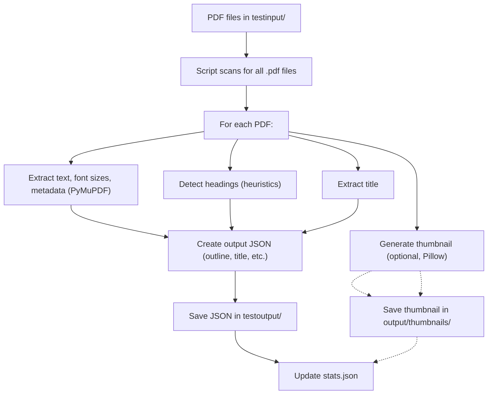

# 📥 Input & Processing Guide

## Processing Flow Diagram



## 1. How Input Files Are Taken

- **Input Directory:**  
  All PDF files to be processed should be placed in the `testinput/` folder for testing, or `input/` for production runs.
- **Automatic Discovery:**  
  The script automatically scans the specified input directory for all files ending with `.pdf` (case-insensitive).
- **No Manual Selection:**  
  Every PDF in the folder will be processed in batch; there is no need to specify filenames.

**Example:**  
If you place these files in `testinput/`:

- `file01.pdf`
- `file02.pdf`
- `file03.pdf`
- `file04.pdf`
- `file05.pdf`

All will be processed in a single run.

---

## 2. Models and Libraries Used

- **PyMuPDF (`fitz`):**  
  Used for parsing PDF files, extracting text, font sizes, and metadata.
- **Pillow (`PIL`):**  
  Used for generating thumbnails of the first page (if enabled).
- **NumPy:**  
  Used for statistical calculations (e.g., finding the most common font size).

**No deep learning or external AI models are used.**  
The extraction is based on heuristics (font size, boldness, text patterns) and is fully offline.

---

## 3. How PDFs Are Processed

- **Font Analysis:**  
  The script determines the most common font size in the first few pages to estimate the "body text" size.
- **Heading Detection:**  
  Headings are detected using a combination of:
  - Font size (larger than body text)
  - Boldness
  - Text patterns (e.g., "Chapter 1", "1. Introduction")
- **Title Extraction:**  
  The script tries to extract the document title from PDF metadata or the first page.
- **Thumbnail Generation (Optional):**  
  If the `--thumbnails` flag is used, a JPEG thumbnail of the first page is created.

---

## 4. Output Files

- **Location:**  
  All outputs are saved in the `testoutput/` folder (or `output/` for production).
- **For Each PDF:**  
  A JSON file named after the PDF (e.g., `file01.json`) is created, containing:
  - `source_file`: Original PDF filename
  - `title`: Extracted document title
  - `outline`: List of detected headings, each with:
    - `level`: H1, H2, or H3 (indicating heading hierarchy)
    - `text`: The heading text
    - `page`: Page number where the heading appears
  - `thumbnail`: (Optional) Path to the generated thumbnail image

**Example Output (`sample1.json`):**

```json
{
  "source_file": "sample1.pdf",
  "title": "50 page sample PDF.indd",
  "outline": [
    { "level": "H1", "text": "[Citation Needed]", "page": 3 },
    { "level": "H2", "text": "Boring Legal Fine Print", "page": 4 },
    ...
  ]
}
```

- **Statistics:**  
  A `stats.json` file is also generated, summarizing:
  - Number of documents processed
  - Total number of headings found
  - Average headings per document

---

## 5. Error Handling & Edge Cases

### Common Errors

| Error Type                      | Cause                                                | Resolution                                                            |
| ------------------------------- | ---------------------------------------------------- | --------------------------------------------------------------------- |
| **No PDF files found**          | Input directory is empty or contains no `.pdf` files | Add PDF files to the input directory                                  |
| **Corrupt PDF**                 | PDF file is damaged or unreadable                    | Remove or replace the problematic file                                |
| **Thumbnail generation failed** | PDF has no pages, or image libraries are missing     | Ensure the PDF is valid and dependencies are installed                |
| **Permission denied**           | Output directory is not writable                     | Check folder permissions or run as administrator                      |
| **Unicode/Encoding errors**     | PDF contains unusual or corrupt text encoding        | Try opening the PDF in a viewer; if it fails, the file may be corrupt |

### Edge Cases

- **PDFs with No Text:**  
  Scanned images or image-only PDFs will not yield headings, as the script relies on extractable text.
- **Very Large PDFs:**  
  Processing may be slow or memory-intensive. The script uses multiprocessing if multiple jobs are specified.
- **Non-English PDFs:**  
  The heading detection is based on font size and patterns, so it may work for other languages, but pattern-based detection (like "Chapter") is English-centric.
- **Unusual Layouts:**  
  Complex layouts, multi-column formats, or decorative fonts may reduce heading detection accuracy.
- **Duplicate Headings:**  
  The script attempts to avoid duplicates by normalizing text, but very similar headings on the same page may still appear.

---

## 6. How to Resolve Errors

- **Check Logs:**  
  The script prints warnings and errors to the console. Review these for details.
- **Validate PDFs:**  
  Open problematic PDFs in a standard viewer to check for corruption.
- **Dependencies:**  
  Ensure all required Python packages are installed:
  ```
  pip install -r requirements.txt
  ```
- **Permissions:**  
  Make sure you have write access to the output directory.

---

## 7. Technical Details

- **Batch Processing:**  
  All PDFs in the input directory are processed in parallel (if multiple jobs are specified).
- **No File Type Filtering:**  
  Only `.pdf` files are processed; other file types are ignored.
- **Output Consistency:**  
  Each PDF always produces a JSON file, even if no headings are found (the outline will be empty).

---

## 8. Example: Files in `testinput/` and Expected Outputs

| Input PDF  | Output JSON | Notes             |
| ---------- | ----------- | ----------------- |
| file01.pdf | file01.json | Outline extracted |
| file02.pdf | file02.json | Outline extracted |
| file03.pdf | file03.json | Outline extracted |
| file04.pdf | file04.json | Outline extracted |
| file05.pdf | file05.json | Outline extracted |

- If thumbnails are enabled, a `thumbnails/` subfolder will be created in the output directory, containing JPEG images for each PDF.

---

## 9. References

- [Project README](https://github.com/jhaaj08/Adobe-India-Hackathon25/blob/main/Challenge_1a/README.md)
- [PyMuPDF Documentation](https://pymupdf.readthedocs.io/)
- [Pillow Documentation](https://pillow.readthedocs.io/)

---

This guide ensures that every aspect of input, processing, output, and error handling is covered in detail for technical and non-technical audiences.
